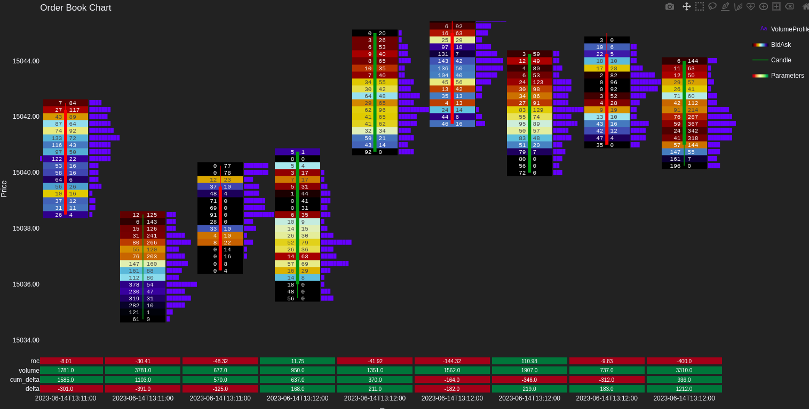

# OrderflowChart

Welcome to the **OrderflowChart** project! This project empowers you to visualize orderflow footprint charts effortlessly using Python and Plotly.

## Usage

The heart of the project is the `OrderFlowChart` class constructor. It's designed to simplify the process of plotting orderflow data on footprint charts, leveraging Plotly's capabilities.

### Constructor

```python
from orderflow_chart import OrderFlowChart
import pandas as pd

# Read orderflow data from CSV
orderflow_data = pd.read_csv(
    ORDERFLOW_CSV,
    names=['bid_size', 'price', 'ask_size', 'identifier'],
    index_col=0,
    parse_dates=True
)

# Read OHLC data from CSV
ohlc_data = pd.read_csv(
    OHLC_CSV,
    index_col=0,
    parse_dates=True,
    names=['open', 'high', 'low', 'close', 'identifier']
)

# Create an instance of OrderFlowChart
orderflowchart = OrderFlowChart(
    orderflow_data,
    ohlc_data,
    identifier_col='identifier'
)

# Plot the orderflow chart
orderflowchart.plot()
```

### Parameters

- **`orderflow_data`**: Your orderflow data, containing columns like 'bid_size', 'price', 'ask_size', and 'identifier'. If the 'imbalance' column needs to be calculated, simply provide it along with the previously mentioned columns.
- **`ohlc_data`**: Your OHLC data with columns 'open', 'high', 'low', 'close', and 'identifier'. The 'identifier' column bridges the gap between orderflow and OHLC data.
- **`identifier_col`**: The column that uniquely identifies candles in both datasets. In case your data is time-indexed (i.e., each candle has a unique timestamp as index), pass *None*.
- **`imbalance_col`**: The column name that contains imbalance for each price level. Provide None if it should be calculated.

### Output

The above code snippet generates a stunning orderflow chart like this:



With OrderflowChart, you can effortlessly transform complex orderflow data into visually appealing and insightful footprint charts. Feel free to explore, customize, and gain new perspectives from your data with this powerful tool.

## Alternative Usage with Preprocessed Data

If you have your data preprocessed and stored in a JSON format, you can use the `OrderFlowChart.from_preprocessed_data` class method to simplify the process further. This method allows you to directly load and plot your orderflow chart without manually reading and parsing CSV files.

### Using Preprocessed Data

```python
from orderflow_chart import OrderFlowChart
import pandas as pd
import json

# Load preprocessed data from JSON
with open('data/preprocessed_data.json', 'r') as f:
    preprocessed_data = json.load(f)

# Create an OrderFlowChart instance using preprocessed data
orderflowchart = OrderFlowChart.from_preprocessed_data(preprocessed_data)

# Plot the orderflow chart
orderflowchart.plot()
```

This approach is particularly useful when dealing with datasets that have been previously cleaned, aggregated, or transformed, allowing for a streamlined visualization process. Ensure your preprocessed data adheres to the expected format as described in the provided Pydantic model documentation. For detailed information on the data structure and the Pydantic model used for preprocessing, please refer to the [Data Model Documentation](docs/data-schema.md).
